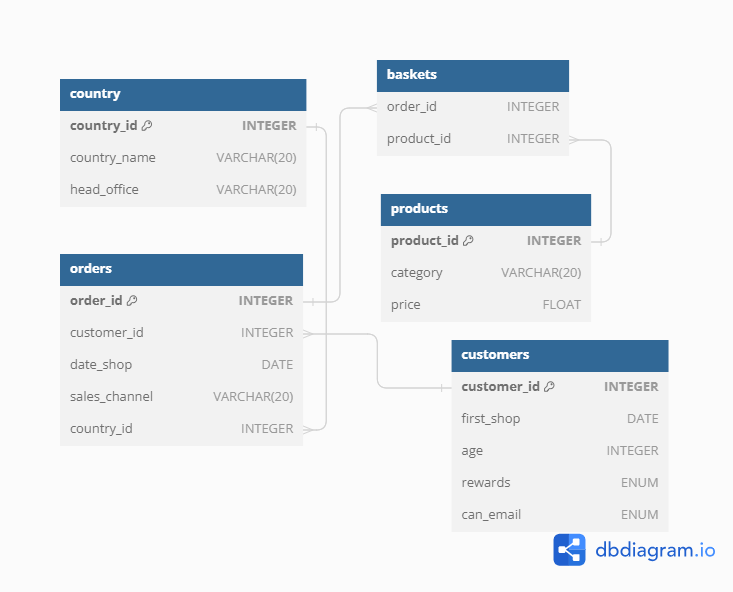
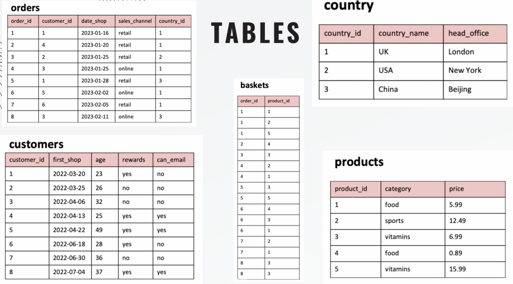

# DataCoach SQL Challenges

This repository serves as the solutions for the challenges from **[DataCoach](https://mattsteel87.wixsite.com/datacoach)**. 

It showcases my ability to tackle various SQL challenges and demonstrates my proficiency in SQL query writing and problem-solving skills.

A special thanks to [Matthew Steel](https://www.linkedin.com/in/matthew-steel-4a7a8915b/) for creating these insightful and engaging SQL challenges!

# Challenge 3 - Customer Insights

## Problem Statement
As a Customer Insights Analyst for 'The General Store', we have to analyse the given data about our customers to provide crucial information to our marketing team.

## Entity Relationship Diagram

## Tables

## Questions

1. What are the names of all the countries in the country table?
2. What is the total number of customers in the customers table?
3. What is the average age of customers who can receive marketing emails (can_email is set to 'yes')?
4. How many orders were made by customers aged 30 or older?
5. What is the total revenue generated by each product category?
6. What is the average price of products in the 'food' category?
7. How many orders were made in each sales channel (sales_channel column) in the orders table?
8. What is the date of the latest order made by a customer who can receive marketing emails?
9. What is the name of the country with the highest number of orders?
10. What is the average age of customers who made orders in the 'vitamins' product category?
    
Access solutions [Here](./Customer_Insights_SQL_Queries.sql)
