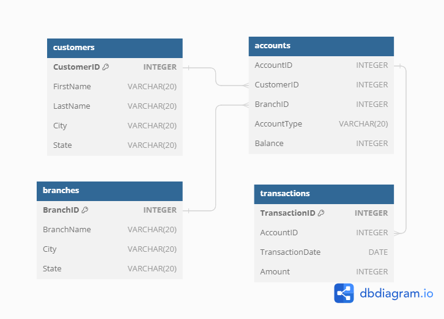
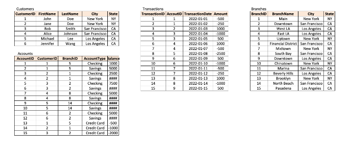

# DataCoach SQL Challenges

This repository serves as the solutions for the challenges from **[DataCoach](https://mattsteel87.wixsite.com/datacoach)**. 

It showcases my ability to tackle various SQL challenges and demonstrates my proficiency in SQL query writing and problem-solving skills.

A special thanks to [Matthew Steel](https://www.linkedin.com/in/matthew-steel-4a7a8915b/) for creating these insightful and engaging SQL challenges!

# Challenge 4 - Finance Analysis

## Problem Statement
As a Finance Analyst at 'The Big Bank', we have been tasked with finding out about our customers and their banking behaviour. We have to examine the accounts they hold and the type of transactions they make to develop greater insight into your customers.

## Entity Relationship Diagram

## Tables

## Questions

1. What are the names of all the customers who live in New York?
2. What is the total number of accounts in the Accounts table?
3. What is the total balance of all checking accounts?
4. What is the total balance of all accounts associated with customers who live in Los Angeles?
5. Which branch has the highest average account balance?
6. Which customer has the highest current balance in their accounts?
7. Which customer has made the most transactions in the Transactions table?
8. Which branch has the highest total balance across all of its accounts?
9. Which customer has the highest total balance across all of their accounts, including savings and checking accounts?
10. Which branch has the highest number of transactions in the Transactions table?
    
Access solutions [Here](./Challenge_4.sql)
