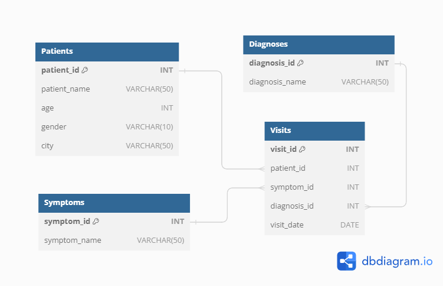
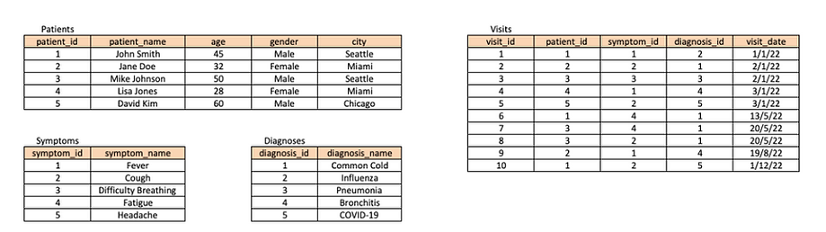

# DataCoach SQL Challenges

This repository serves as the solutions for the challenges from **[DataCoach](https://mattsteel87.wixsite.com/datacoach)**. 

It showcases my ability to tackle various SQL challenges and demonstrates my proficiency in SQL query writing and problem-solving skills.

A special thanks to [Matthew Steel](https://www.linkedin.com/in/matthew-steel-4a7a8915b/) for creating these insightful and engaging SQL challenges!

# Challenge 7 - Healthcare Analysis

## Problem Statement
As a Healthcare Analyst, we have been tasked to analyse the hospital records to track the progress of some common illnesses so that we can help inform a public health programme.

## Entity Relationship Diagram

## Tables

## Questions

1. Write a SQL query to retrieve all patients who have been diagnosed with COVID-19.
2. Write a SQL query to retrieve the number of visits made by each patient, ordered by the number of visits in descending order.
3. Write a SQL query to calculate the average age of patients who have been diagnosed with Pneumonia.
4. Write a SQL query to retrieve the top 3 most common symptoms among all visits.
5. Write a SQL query to retrieve the patient who has the highest number of different symptoms reported.
6. Write a SQL query to calculate the percentage of patients who have been diagnosed with COVID-19 out of the total number of patients.
7. Write a SQL query to retrieve the count of visits in each city.
8. Write a SQL query to find the patient who has the highest number of visits in a single day, along with the corresponding visit date.
9. Write a SQL query to retrieve the average age of patients for each diagnosis, ordered by the average age in descending order.
10. Write a SQL query to calculate the cumulative count of visits over time, ordered by the visit date.
    
Access solutions [Here](./Challenge_7.sql)
