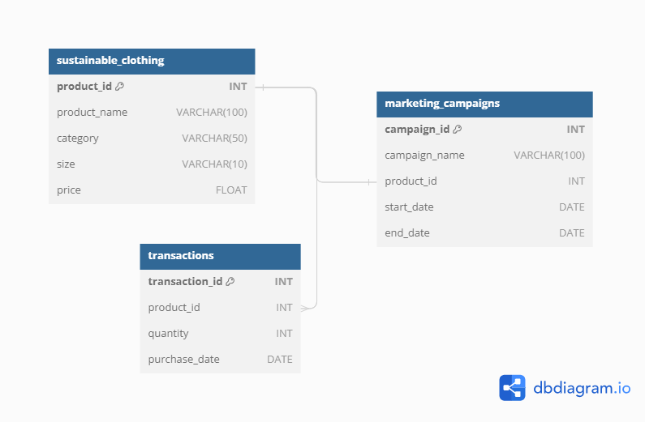
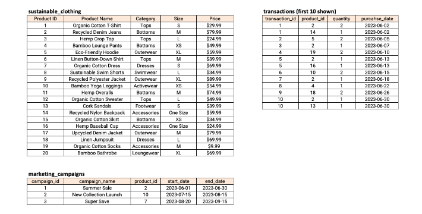

# DataCoach SQL Challenges

This repository serves as the solutions for the challenges from **[DataCoach](https://mattsteel87.wixsite.com/datacoach)**. 

It showcases my ability to tackle various SQL challenges and demonstrates my proficiency in SQL query writing and problem-solving skills.

A special thanks to [Matthew Steel](https://www.linkedin.com/in/matthew-steel-4a7a8915b/) for creating these insightful and engaging SQL challenges!

# Challenge 6 - Marketing Analysis

## Problem Statement
As a Marketing Analyst at The 'Sustainable Clothing Co.', we have been tasked to provide insights into whether several marketing campaigns organized by the company have been successful or not. We have to analyse the data and answer some of the questions.

## Entity Relationship Diagram

## Tables

## Questions

1. How many transactions were completed during each marketing campaign?
2. Which product had the highest sales quantity?
3. What is the total revenue generated from each marketing campaign?
4. What is the top-selling product category based on the total revenue generated?
5. Which products had a higher quantity sold compared to the average quantity sold?
6. What is the average revenue generated per day during the marketing campaigns?
7. What is the percentage contribution of each product to the total revenue?
8. Compare the average quantity sold during marketing campaigns to outside the marketing campaigns.
9. Compare the revenue generated by products inside the marketing campaigns to outside the campaigns.
10. Rank the products by their average daily quantity sold.
    
Access solutions [Here](./Challenge_6.sql)
