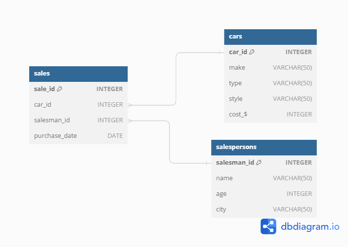

# Challenge 1 - Steve's Car Showroom

## Problem Statement
Steve runs a top-end car showroom but his data analyst has just quit and left him without his crucial insights. We have to analyse the data to provide him with all the answers he requires.

## Entity Relationship Diagram

## Tables

## Questions

1. What are the details of all cars purchased in the year 2022?
2. What is the total number of cars sold by each salesperson?
3. What is the total revenue generated by each salesperson?
4. What are the details of the cars sold by each salesperson?
5. What is the total revenue generated by each car type?
6. What are the details of the cars sold in the year 2021 by salesperson 'Emily Wong'?
7. What is the total revenue generated by the sales of hatchback cars?
8. What is the total revenue generated by the sales of SUV cars in the year 2022?
9. What is the name and city of the salesperson who sold the most number of cars in the year 2023?
10. What is the name and age of the salesperson who generated the highest revenue in the year 2022?
    
Access solutions [Here](./Steve_Car_Showroom_SQL_Queries.sql)
